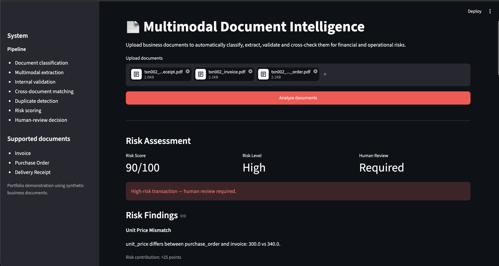
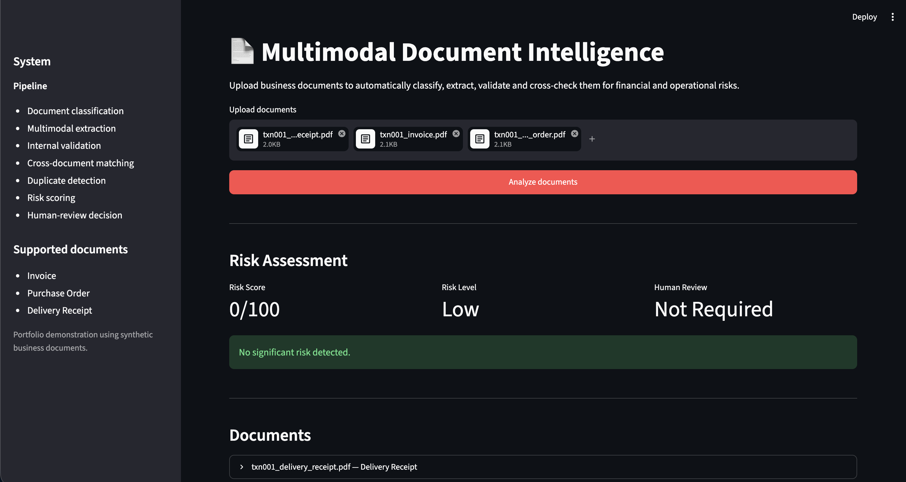

# Multimodal Document Intelligence

An end-to-end AI system for analyzing business documents, extracting structured data, validating financial information, comparing related documents, detecting potential duplicates, and routing risky transactions for human review.

## Live Demo

https://multimodal-document-intelligence-eqwvanzp5rawtwfgtufgqv.streamlit.app/

## Overview

The system supports invoices, purchase orders, and delivery receipts in PDF or image format.

Pipeline:

Document Upload  
↓  
Document Classification  
↓  
Multimodal Structured Extraction  
↓  
Internal Validation  
↓  
Cross-Document Matching  
↓  
Duplicate Detection  
↓  
Risk Assessment  
↓  
Human Review Decision

The project is designed as an advanced AI engineering portfolio system rather than a standalone OCR demo.

## Features

- PDF and image document ingestion
- Multimodal document classification
- Structured field extraction
- Pydantic schema validation
- Financial calculation checks
- VAT validation
- Cross-document transaction matching
- Duplicate invoice detection
- Explainable risk scoring
- Human-review routing
- Streamlit user interface
- Automated tests
- Reproducible evaluation suite

## Supported Document Types

- Invoice
- Purchase Order
- Delivery Receipt

## Synthetic Dataset

The project includes synthetic business documents generated specifically for evaluation.

Three transactions are represented:

- TXN-001 — clean and internally consistent
- TXN-002 — contains pricing and delivery discrepancies
- TXN-003 — image-based invoice used to validate multimodal extraction

No real customer or company data is used.

## Document Loading

PDF documents are processed with PyMuPDF.

For PDFs, the system extracts:

- embedded text
- page count
- rendered page images

Image documents are loaded using Pillow.

Supported input formats:

- PDF
- PNG
- JPG
- JPEG

## Document Classification

Documents with embedded text are first classified using deterministic text rules.

Image-only documents use a multimodal OpenAI model.

Supported labels:

- invoice
- purchase_order
- delivery_receipt
- unknown

## Structured Extraction

Each document is normalized into a shared schema containing fields such as:

- transaction ID
- document number
- purchase order number
- supplier
- customer
- date
- item
- quantity
- quantity delivered
- unit price
- subtotal
- VAT rate
- VAT
- total
- currency
- delivery status

Missing information is represented explicitly rather than invented.

## Internal Validation

The validation engine checks:

- required fields
- quantity × unit price = subtotal
- subtotal × VAT rate = VAT
- subtotal + VAT = total

Invalid calculations generate explainable findings.

## Cross-Document Matching

Purchase orders, invoices, and delivery receipts belonging to the same transaction are compared.

The system checks fields including:

- transaction ID
- PO number
- supplier
- customer
- item
- quantity
- unit price
- subtotal
- VAT
- total
- delivered quantity

Example anomalies in TXN-002:

- Unit price: 300 EUR vs 340 EUR
- Ordered quantity: 20
- Delivered quantity: 18

## Duplicate Detection

Invoices are compared using a weighted similarity model.

Signals include:

- normalized invoice number
- supplier similarity
- total amount
- date
- PO number

The duplicate detector also handles formatting differences such as:

INV-2001

and:

INV2001

In testing, the near-duplicate example produced a similarity score of 99.5%.

## Risk Engine

Validation issues, cross-document mismatches, and duplicate findings are converted into an explainable risk score.

Risk levels:

- Low
- Medium
- High

Transactions can be automatically routed for human review.

Example TXN-002 result:

- Risk Score: 90/100
- Risk Level: High
- Human Review: Required

Each risk contribution is shown individually rather than hidden behind a black-box score.

## Evaluation

The deterministic evaluation suite currently covers:

- clean transaction matching
- cross-document anomaly detection
- financial validation
- duplicate invoice detection
- human-review routing

Current result:

5/5 checks passed — 100%

This is a small project-specific evaluation suite and is not intended as a general production benchmark.

Run:

python scripts/evaluate_system.py

## Automated Tests

The project currently contains six automated tests covering:

- valid financial documents
- incorrect financial calculations
- consistent cross-document transactions
- quantity mismatches
- duplicate invoice detection
- high-risk human-review routing

Current result:

6 passed

Run:

pytest -q

## Application Screenshots

### High-Risk Transaction

### Clean Transaction

## Project Structure

- app/app.py — Streamlit application
- src/document_loader.py — PDF and image ingestion
- src/document_classifier.py — document classification
- src/extraction.py — multimodal structured extraction
- src/validation.py — internal document validation
- src/matching.py — cross-document comparison
- src/duplicate_detection.py — invoice duplicate detection
- src/risk.py — explainable risk scoring
- src/pipeline.py — end-to-end orchestration
- scripts/generate_documents.py — synthetic document generator
- scripts/evaluate_system.py — evaluation suite
- tests/ — automated tests
- data/generated/ — locally generated synthetic documents
- images/app/ — application screenshots

## Run Locally

Clone the repository:

git clone https://github.com/Vercetius/multimodal-document-intelligence.git

Enter the project:

cd multimodal-document-intelligence

Create a virtual environment:

python3.12 -m venv .venv

Activate it:

source .venv/bin/activate

Install dependencies:

pip install -r requirements.txt

Create a local .env file containing:

OPENAI_API_KEY=your_api_key_here

OPENAI_MODEL=gpt-5.6-luna

Generate the synthetic documents:

python scripts/generate_documents.py

Run the application:

streamlit run app/app.py

## Security

The real API key is stored only in the local .env file.

The .env file is excluded from Git through .gitignore and must never be committed.

## Limitations

This is an advanced portfolio prototype rather than a production financial auditing platform.

Current limitations include:

- small synthetic dataset
- only three supported document types
- extraction depends on an external multimodal model
- risk weights are explicitly designed for this demonstration
- duplicate detection uses deterministic weighted similarity
- no authentication or organization-level permissions
- no accounting or ERP integration
- no persistent transaction database
- no production observability or audit infrastructure

A production implementation would require broader evaluation, stronger OCR fallbacks, confidence calibration, security controls, access management, audit logs, data governance, monitoring, and integration with enterprise systems.

## Tech Stack

- Python
- Streamlit
- OpenAI API
- Pydantic
- PyMuPDF
- Pillow
- ReportLab
- pytest

## License

MIT License.
